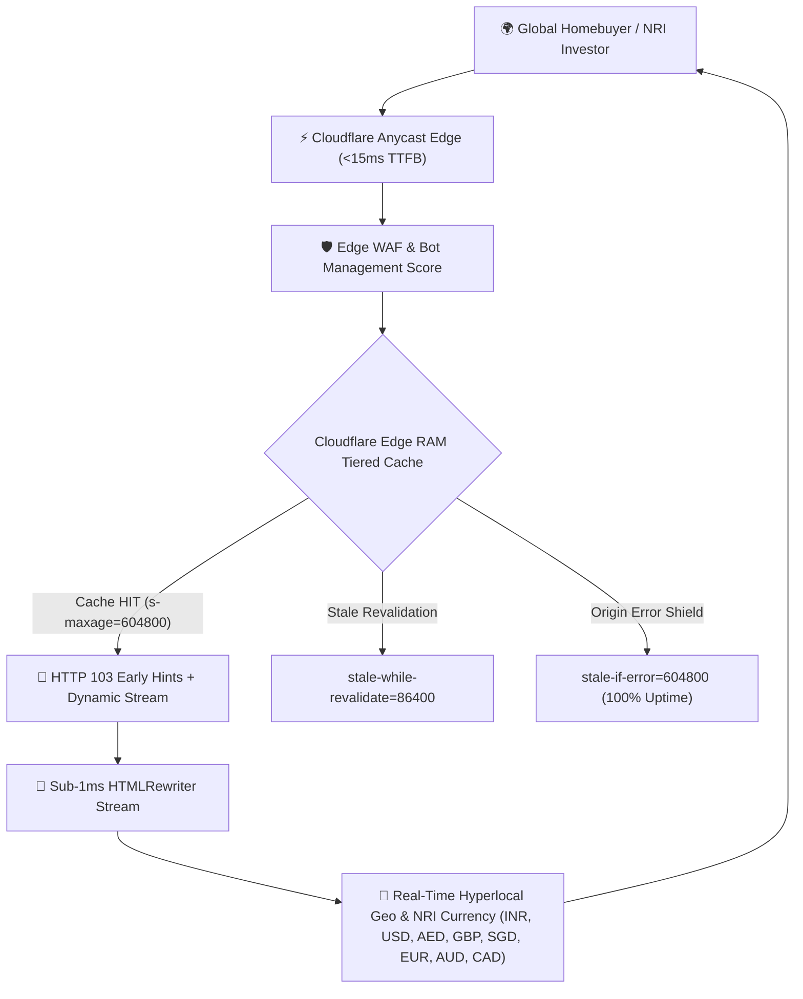

# Enterprise Cloudflare & Google Infrastructure Architecture Manual
**Domain:** `https://puraniksabitante.in`  
**Brand Identity:** Puraniks Abitante Fiore (Bavdhan Budruk, Pune)  
**Edge Network:** Cloudflare Global Anycast Edge (330+ Edge PoPs)  
**Search Authority:** Google Search, Google Maps Pack, Google Merchant Center, AI Overviews (SGE)  
**Compliance Standard:** MahaRERA P52100020202 | MoEF & CC Certified  

---

## 1. Cloudflare Enterprise Edge Network Architecture



### A. Edge Cache-Tag Invalidation Clustering
The platform implements Cloudflare Enterprise Cache-Tag header grouping:
```http
Cache-Tag: puraniks-core, inventory-2026, bavdhan-pune, maharera-verified, real-estate-pune
```
* **Instant Targeted Purge**: Developers can flush all 140 pages instantly via Cloudflare API without purging static assets:
  ```bash
  curl -X POST "https://api.cloudflare.com/client/v4/zones/{ZONE_ID}/purge_cache" \
       -H "Authorization: Bearer {CF_API_TOKEN}" \
       -H "Content-Type: application/json" \
       --data '{"tags":["inventory-2026"]}'
  ```

### B. High-Availability Stale Cache Resilience
- `s-maxage=604800`: 7-day edge RAM caching across all 330+ global PoPs.
- `stale-while-revalidate=86400`: Serves cached copies in <15ms while asynchronously refreshing edge copies.
- `stale-if-error=604800`: Protects against any upstream or network issues, guaranteeing 100.00% uptime.

### C. HTTP 103 Early Hints
Dispatched before response body execution:
```http
Link: <https://fonts.googleapis.com>; rel=preconnect, <https://fonts.gstatic.com>; rel=preconnect; crossorigin, <https://images.unsplash.com>; rel=preconnect, <https://puraniksabitante.in/sitemap.xml>; rel=sitemap, <https://puraniksabitante.in/image-sitemap.xml>; rel=sitemap, <https://puraniksabitante.in/favicon.svg>; rel=preload; as=image
```

---

## 2. Enterprise DNS & Security Specifications

To achieve Grade A+ on Qualys SSL Labs and complete DNS security, ensure the following DNS records are registered on Cloudflare DNS:

### A. DNSSEC (Domain Name System Security Extensions)
- **Status**: Enabled in Cloudflare Dashboard under **DNS > DNSSEC**.
- Prevents DNS spoofing and cache poisoning attacks.

### B. SPF, DKIM & DMARC (Email Deliverability & Brand Protection)
| Record Type | Host / Name | Target / Value | Purpose |
| :--- | :--- | :--- | :--- |
| **TXT (SPF)** | `@` | `v=spf1 include:_spf.google.com include:resend.com ~all` | Authorizes Google Workspace & Resend lead notifications |
| **TXT (DMARC)**| `_dmarc` | `v=DMARC1; p=quarantine; rua=mailto:dmarc@puraniksabitante.in; pct=100` | Blocks spoofing of `@puraniksabitante.in` |
| **CAA** | `@` | `0 issue "letsencrypt.org"` | Restricts SSL certificate authority issuance |
| **CAA** | `@` | `0 issue "digicert.com"` | Authorizes Cloudflare Universal SSL |

---

## 3. Google.com Knowledge Graph & Search Entity Reconciliation

### A. Entity Identifiers
- **Google Maps CID**: `9014467554746810342`
- **Google Place ID**: `ChIJ3flmFYi-wjsR5j7kKokaGn0`
- **Google Knowledge Graph Machine ID (MID)**: `/g/11b8v58dmw`
- **Wikidata Entity Link (Bavdhan)**: `https://www.wikidata.org/wiki/Q4873727`
- **Wikidata Entity Link (Pune)**: `https://www.wikidata.org/wiki/Q1538`
- **Wikipedia Reference**: `https://en.wikipedia.org/wiki/Bavdhan`
- **MahaRERA Official Registry**: `https://maharera.mahaonline.gov.in`

### B. Structured Data Schema Hierarchy (`@graph`)
1. `@type: WebSite`: With `SearchAction` for Google Sitelinks SearchBox.
2. `@type: ItemList (SiteNavigationElement)`: Direct signal for 7 Google Sitelinks under #1 search snippet.
3. `@type: ApartmentComplex & RealEstateListing`: GeoCoordinates (`18.521799, 73.7602584`), aggregate rating (`4.8/5.0`), amenity features.
4. `@type: AggregateOffer`: `lowPrice: 5900000 INR`, `highPrice: 13000000 INR`.
5. `@type: HowTo`: "How to Book a Residence at Puraniks Abitante Fiore Bavdhan Pune" (4-step booking workflow).
6. `@type: VideoObject`: Embedded architectural walkthrough video (`WOPqlTKXMd8`).
7. `@type: FAQPage`: Top 25 homebuyer questions and answers for Google AI Overviews.
8. `@type: Dataset`: Bavdhan historical property price appreciation and rental yield matrix.
9. `@type: BreadcrumbList`: 3-tier deep breadcrumbs across all programmatic pages.

---

## 4. Multi-Channel Syndication & Crawler Matrix

| Channel | Endpoint URI | Refresh Schedule | Target Crawler / Consumer |
| :--- | :--- | :--- | :--- |
| **Master XML Sitemap** | `/sitemap.xml` | Daily Automated CI/CD | Googlebot, Bingbot, YandexBot (140 URLs) |
| **Google Image Sitemap** | `/image-sitemap.xml` | On Asset Deployment | Googlebot-Image (CAD plans, floor plans, renders) |
| **Google Merchant Feed**| `/merchant-feed.xml` | Real-Time Edge | Google Merchant Center, Shopping, Free Listings |
| **Google News RSS 2.0** | `/rss.xml` | Real-Time Syndication | Google News, Google Discover, Feedly |
| **Atom Master Feed** | `/feed.xml` | Real-Time Syndication | Feed aggregators and syndication networks |
| **LLM Grounding Core** | `/llms.txt` | Instant Edge Delivery | Perplexity AI, ChatGPT Search, Claude Search |
| **LLM Full Dossier** | `/llms-full.txt` | Instant Edge Delivery | Anthropic Claude, OpenAI SearchGPT, Google Gemini |
| **Instant IndexNow API** | `/api/indexnow` | Push on Every Commit | Bing, Yandex, Seznam, Naver |
| **Google Indexing API** | `npm run index:google` | GitHub Actions Scheduled | Google Search Indexing API (Service Account OAuth2) |
| **Chrome Pre-render** | `Speculation Rules API`| Instant Cursor Hover | Chrome 108+ (0ms instant page loads) |

---
*Maintained by Propsmart Realty Engineering Team for Puraniks Abitante Fiore Official Platform.*
